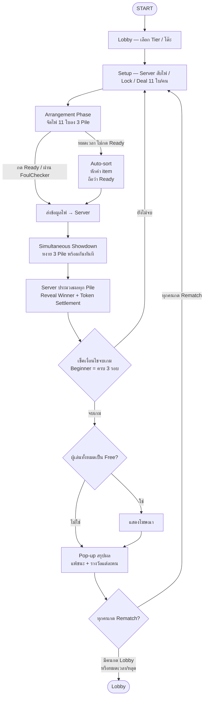
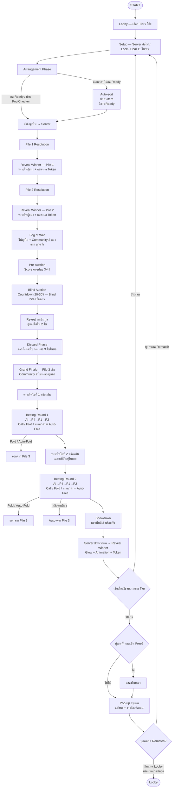

# TriplePoker — Game Flow Reference
> Version 1.2 | อ้างอิงจาก Master Plan v7.0 | Updated: May 2026
 
**Changelog v1.2:** เพิ่ม Beginner Simplified Flow (Section 0) — Progressive Game Mechanics by Tier
 
---
 
## 0. Progressive Game Mechanics by Tier ⭐ NEW v1.2
 
> Game flow แตกต่างกันตาม Tier — ความซับซ้อนเพิ่มขึ้นทีละชั้น
 
| Phase | Beginner | Pro | Boss / Last Boss |
|-------|----------|-----|-----------------|
| Arrangement | ✅ เหมือนกัน | ✅ เหมือนกัน | ✅ เหมือนกัน |
| Pile 1 & 2 Resolution | ✅ มี | ✅ มี | ✅ มี |
| Fog of War | ❌ ไม่มี | ✅ มี | ✅ มี |
| Pre-Auction Score Overlay | ❌ ไม่มี | ✅ มี | ✅ มี |
| Blind Auction | ❌ ไม่มี | ✅ มี | ✅ มี |
| Discard Phase | ❌ ไม่มี | ✅ มี | ✅ มี |
| Grand Finale Betting | ❌ ไม่มี | ✅ มี | ✅ มี |
| Pile 3 Showdown | หงายพร้อมกันทันที | หลัง Betting Round 2 | หลัง Betting Round 2 |
 
---
 
## 0.1 Beginner Simplified Flow
 

 
### Beginner — Pile 3 พิเศษ
- ใช้ไพ่ 5 ใบในมือ + Community 2 ใบ = 7 ใบ เปรียบ Best 5
- **ไม่มี Discard** ก่อน Showdown
- หงายพร้อมกับ Pile 1 & 2 ในขั้นตอนเดียว
### Beginner AI — First-Valid Arrangement
```
1. สุ่มจัดไพ่ 11 ใบลง 3 Pile
2. ตรวจ FoulChecker
3. ผ่าน → ใช้ arrangement นี้เลย (หยุดทันที)
4. ไม่ผ่าน → สุ่มใหม่ วนซ้ำจนผ่าน
```
 
---
 
## 0.2 Full Game Flow (Pro / Boss / Last Boss)
 

 
---
 
## UX Detail — แต่ละ Phase
 
---
 
### 1. Lobby & Setup
 
- ผู้เล่นเลือก Tier ตามสิทธิ์ (ระดับสูงลงต่ำได้ / ต่ำขึ้นสูงไม่ได้)
- โต๊ะ: User 3 คน + AI 1 ตัวเสมอ (ป้องกันการพนัน)
- Server สับไพ่ / Lock ใบโอกาสสูง / Deal 11 ใบ/คน
- Community Cards 6 ชุด เปิดตาม step ก่อนแจก
---
 
### 2. Arrangement Phase
 
**เป้าหมาย:** ผู้เล่นจัดไพ่ 11 ใบลง Pile 1 (3ใบ) / Pile 2 (3ใบ) / Pile 3 (5ใบ) ตามกติกา pile1 < pile2 < pile3
 
**การโต้ตอบ:**
- **Tap-to-Swap** เป็น default — แตะใบแรก (selected) แตะใบสอง → สลับตำแหน่ง
- **Auto-sort** จัดให้อัตโนมัติ (หักค่า item ตาม level)
**Countdown Bar (มุมบนขวา):**
| สีแถบ | สถานะ |
|--------|--------|
| 🟢 Green | เวลาปกติ |
| 🟡 Yellow | เหลือ 30% |
| 🔴 Red + Haptic | เหลือ 10% |
 
- ใช้ item ต่อเวลา → แถบ extend + pulse animation สีทอง
- หมดเวลาโดยไม่กด Ready → Auto-sort ทำงาน + toast แจ้งหัก token
- กด Ready → FoulChecker ตรวจบน client ก่อน → ส่ง server
**หลัง Ready (แยกตาม Tier):**
| Tier | ขั้นตอนถัดไป |
|------|-------------|
| Beginner | Simultaneous Showdown ทันที |
| Pro / Boss / Last Boss | Pile 1 Resolution → Sequential flow |
 
---
 
### 3. Simultaneous Showdown (Beginner เท่านั้น) ⭐
 
**Sequence:**
1. นับถอยหลัง 3-2-1 (dramatic pause)
2. ไพ่ทั้ง 3 Pile หงายพร้อมกันทุกคน
3. Server ประมวลผลและส่งผล Winner ทุก Pile พร้อมกัน
4. Winner glow gold + token animation ทุก Pile พร้อมกัน
5. แสดงผลสรุป Token +/- ของแต่ละคน
**ไม่มี:** Fog of War, Auction overlay, Discard UI, Betting buttons
 
---
 
### 4. Pile 1 & 2 Resolution (Pro+ เท่านั้น)
 
**Reveal Timing ตาม Tier:**
| Tier | Reveal Time |
|------|-------------|
| Pro | 6 วินาที |
| Boss | 5 วินาที |
| The Last Boss | 5 วินาที + slow-mo flash |
 
**Sequence:**
1. Pile 1: ไพ่ผู้ชนะหงาย → กรอบ winner กลาย gold → token animation ไหลเข้า-ออก
2. Pile 2: เดิมซ้ำ — pause สั้นระหว่าง pile ให้อ่านผล
3. ไพ่ผู้ชนะ glow + scale up ช่วง 2วิสุดท้าย
4. เสียง chip ไหลเข้า pot ระหว่างนับ token
**Fog of War:**
- ไพ่ทุกใบ + Community Cards ของ Pile 1&2 ถูกคว่ำพร้อมกัน
- ใช้ card flip animation — ไม่หายทันที
---
 
### 5. Pre-Auction Score Overlay (Pro+ เท่านั้น)
 
- แสดง 3-4 วินาทีก่อน Auction เริ่ม
- Mini scoreboard รวม token Pile 1+2
- ให้ผู้เล่นประเมินว่า "ต้องชนะ Pile 3 หรือแค่ไม่แพ้มาก"
---
 
### 6. Blind Auction (Pro+ เท่านั้น)
 
- หน้าจอ overlay มืดลง ตัดสิ่งรบกวน
- ไพ่ 2 ใบประมูลแสดงตรงกลาง (คว่ำ — Blind)
- Dropdown 6 ระดับราคา + countdown bar วิ่งสีแดง
- AI seat แสดง "Thinking..." animation (bluff ความรู้สึก)
**หลัง Auction ปิด:**
- หงายไพ่ 2 ใบพร้อมกัน → ผู้ชนะ highlight gold
- Token animation ไหล → ไพ่ slide เข้า Pile 3 ของผู้ชนะ
---
 
### 7. Discard Phase (Pro+ เท่านั้น)
 
- แสดงไพ่ในมือทั้งหมด + Community 2 ใบของ Pile 3 พร้อมกัน
- **Drag ทีละใบไปทิ้งในกองกลาง** จนเหลือ 3 ใบในมือ
- System highlight Best 3 แนะนำ — ผู้เล่นปรับเองได้
- countdown ตาม tier
---
 
### 8. Grand Finale — Pile 3 (Pro+ เท่านั้น)
 
**สถานะเริ่มต้น:**
- Community 2 ใบ → หงายอยู่ตลอด (ทุกคนเห็นมาตลอด)
- ไพ่ในมือแต่ละคน 3 ใบ → คว่ำ (Fog of War)
**Betting Order (ทั้ง 2 รอบ):**
```
AI(P3) → P4 → P1 → P2
```
- Action: **Call หรือ Fold เท่านั้น** (ไม่มี Raise)
- Seat ที่ถึงตา → กรอบ glow / ที่เหลือ dim ลง
- Fold → ไพ่คว่ำ + seat มืดลง ออกจากวงทันที
- **หมดเวลาโดยไม่กด** → Auto-Fold + Toast แจ้งผู้เล่น
- เหลือผู้เล่นคนเดียวไม่ Fold → **Auto-win Pile 3** ไม่ต้อง Showdown
**เวลาตัดสินใจต่อ Turn:**
| Tier | เวลา Bet |
|------|---------|
| Pro | 10 วินาที |
| Boss | 8 วินาที |
| The Last Boss | 8 วินาที |
 
**Betting Round 1:**
- หงายไพ่ใบที่ 1 พร้อมกัน (dramatic flip)
- System preview hand ปัจจุบัน เช่น "Pair possible"
- Betting sequence ตามลำดับ
**Betting Round 2:**
- หงายไพ่ใบที่ 2 พร้อมกัน (เฉพาะที่ยังอยู่)
- ตอนนี้เห็น 4 ใบ → hand ชัดขึ้น
- Preview update เช่น "Flush draw" / "Two pair"
- Betting sequence ตามลำดับ
**Showdown:**
- หงายใบที่ 3 ช้าที่สุดในเกม — built-in suspense สูงสุด
- Hand rank label ขึ้นทีละคน
- ผู้ชนะ → glow gold + chip sound + winner animation
- Royal Flush → full-screen particle effect
---
 
### 9. เงื่อนไขจบเกมตาม Tier
 
| Tier | รอบสูงสุด | เงื่อนไขชนะ |
|------|-----------|------------|
| Beginner | 3 | ครบจำนวนรอบ |
| Pro | 5 | ชนะ Pile 3 ≥ 2 ครั้ง หรือครบรอบ |
| Boss | 6 | ชนะ Pile 3 ≥ 3 ครั้ง หรือ 2 ครั้ง+Token 4x หรือครบรอบ |
| The Last Boss | 5 | ชนะ Pile 3 ≥ 2 ครั้ง หรือ 1 ครั้ง+Token 4x หรือครบรอบ |
 
> Beginner นับ "รอบ" จาก Simultaneous Showdown — ไม่ใช่ Pile 3 win condition
 
- **ยังไม่จบ** → Loop กลับ Setup (สับไพ่แจกใหม่)
- **จบเกม** → เข้า End of Match flow
---
 
### 10. End of Match
 
**Ad Logic:**
- ผู้เล่นทั้ง 3 คนเป็น Free user → แสดงโฆษณาก่อน
- มีผู้เล่น VIP อย่างน้อย 1 คน → ข้าม Ad
**Pop-up สรุปผล:**
- แสดงผลแพ้ชนะรวมของโต๊ะ + รางวัลแต่ละคน (Token, XP)
- 2 ปุ่ม: **Rematch** / **Lobby**
**Rematch Logic:**
| สถานการณ์ | ผลลัพธ์ |
|-----------|---------|
| ทุกคนกด Rematch | เริ่มเกมใหม่ทันที |
| มีคนกด Lobby | ทุกคนหลุดโต๊ะ → Lobby |
| มีคนหมดเวลา / หลุดจากเกม | ถือว่ากด Lobby → ทุกคนกลับ Lobby |
 
---
 
*TriplePoker Game Flow Reference v1.2 — The Sage Unicorn Studio Co., Ltd.*
*Founder & Chief Architect: Assistant Professor Pongnathee Maneekul*