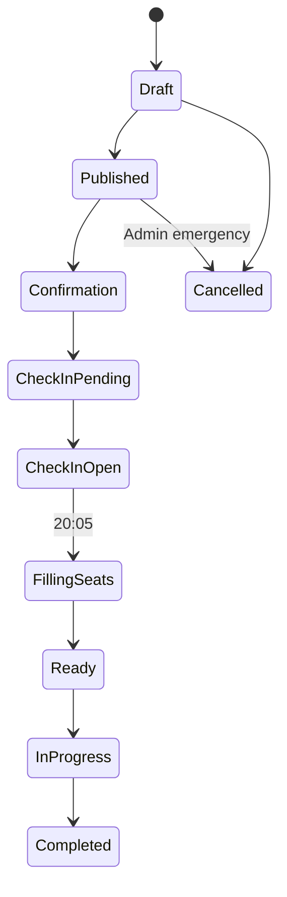

# TriplePoker: The Arena
## Tier S+ — The Last Boss AI Live Event Technical Specification

**Document version:** 1.0
**Status:** Approved baseline for development
**Date:** 2026-08-01
**Target stack:** TypeScript client/server, authoritative game server, persistent database, realtime event transport

---

## 1. Purpose

This document specifies the monthly Tier S+ live-event system in which nine qualified players compete across three matches against **The Last Boss AI**. It covers qualification, confirmation, scheduled check-in, Tier S standby substitution, Crown reservation, data-driven spectator mode, the 30-second spectator delay, security, recovery, and acceptance criteria.

The implementation must remain server-authoritative. The client displays state and submits commands; it must not decide qualification, queue order, no-show status, Crown eligibility, seat assignment, event visibility time, or card visibility.

## 2. Scope

### In scope

- Monthly qualification of nine players
- Three matches: Friday, Saturday, and Sunday of the final week of the month
- Three player seats plus The Last Boss AI per match
- Qualification paths: Veteran, Rising Star, and Ascendant Rookie
- Selected-player confirmation and pre-event replacement
- 20:00–20:05 check-in window
- Tier S standby queue using server-time FCFS
- Crown balance reservation and settlement
- Public spectator event feed delayed by 30 seconds
- Promotion of a spectator/standby user to a player before match start
- Audit logs, reconnection, idempotency, and operational controls

### Out of scope

- Video streaming or video recording
- Voice/text chat
- Team/faction-balanced selection
- Team scoring
- Rewriting the core card-game engine or The Last Boss AI
- Public wagering on the live event
- Full match replay outside the live-event feed

## 3. Locked business rules

1. Tier S+ is a monthly right and lasts only for the applicable monthly cycle.
2. A maximum of nine human players receive Tier S+ match seats each month.
3. The month contains exactly three Tier S+ matches, with three human seats in each match.
4. Matches are held on Friday, Saturday, and Sunday of the final event week.
5. The selected list is announced on Sunday of week 3.
6. Selected players must confirm by the configured Wednesday deadline.
7. Unconfirmed seats are offered to pre-event reserves in selection order.
8. A confirmed player must check in between 20:00:00 and 20:04:59.999 local event time.
9. At 20:05:00, an unchecked confirmed player becomes a no-show for that match.
10. Any eligible Tier S player may enter the event as a spectator and join standby if Crown requirements are met.
11. Standby priority is **First Come, First Served**, determined only by the timestamp and sequence assigned by the server.
12. At 20:05, vacant seats are filled immediately from the valid standby queue.
13. All game members may spectate the match.
14. Spectators receive public game events exactly 30 seconds after the corresponding real event.
15. The spectator client must never receive hidden cards or private player state.
16. Ascendant Rookie eligibility is consumed only after the player actually starts a Last Boss match in that seat, not on selection or confirmation.
17. Faction affiliation is lore metadata only and does not affect qualification, seating, or scoring.

## 4. Default configurable values

All values below must be server configuration, not hard-coded in UI components.

```ts
export interface TierSPlusConfig {
  timezone: 'Asia/Bangkok';
  selectionMinCompletedMatches: 10;
  selectedPlayerCount: 9;
  matchesPerMonth: 3;
  humansPerMatch: 3;
  announcementRule: 'SUNDAY_OF_WEEK_3';
  confirmationDeadlineLocal: string; // Wednesday, default 23:59:59
  standbyOpenLocal: string;          // default 19:45:00
  checkInOpenLocal: string;          // 20:00:00
  checkInCloseLocal: string;         // 20:05:00, exclusive
  matchStartLocal: string;           // default 20:05:30
  spectatorDelayMs: 30_000;
  standbyReconnectGraceMs: 20_000;
  seatAcceptTimeoutMs: 10_000;
  requiredCrown: number;             // product/economy config; no value assumed here
  useBotWhenHumanSeatsUnfilled: true;
  maxSpectatorsPerEvent: number;
}
```

The economy owner must supply `requiredCrown` before production launch. Development and staging may use an environment-specific test value.

## 5. Monthly event generation

Create one `tier_s_plus_cycle` per calendar month using `Asia/Bangkok` for all business deadlines. Store all timestamps in UTC and render them in the configured timezone.

The scheduler must calculate the final Friday, Saturday, and Sunday belonging to the final event weekend of the month. Dates must be previewable by an administrator before publishing. Once a cycle is published, schedule changes require an explicit admin action and audit record.

Each match is assigned one planned Veteran seat, one Rising Star seat, and one Ascendant Rookie seat. Across the month the target allocation is therefore three seats per path. This path label explains how the user qualified; it does not constrain faction.

## 6. Qualification and seat assignment

### 6.1 Eligibility baseline

A candidate must:

- be Tier S and in good standing at the qualification snapshot;
- have completed at least 10 eligible matches during the cycle's scoring window;
- not be banned, suspended, or under a match-integrity hold;
- satisfy the selected path's specific rules.

### 6.2 Selection order

To prevent duplicate assignment when one user qualifies through multiple paths:

1. Select three eligible Ascendant Rookies who have never consumed the one-time Rookie opportunity.
2. Select three eligible Veterans who have previously faced The Last Boss and are not already selected.
3. Select three Rising Stars from the highest monthly Performance Score rankings who are not already selected.
4. If a path has fewer than three candidates, fill its vacant seats from the next eligible monthly ranking candidates not already selected. Preserve the original planned path and store the actual `selectionSource = FALLBACK_RANKING`.

Tie-breakers must reuse the authoritative monthly-ranking rules. The selection job must write the score snapshot and ranking position used, so later ranking changes cannot silently alter a published selection.

### 6.3 Distribution across matches

Use deterministic round-robin distribution: path rank 1 goes to Friday, rank 2 to Saturday, and rank 3 to Sunday. Admins may move a player only before confirmation closes, with a reason and audit record.

### 6.4 Pre-event confirmation replacement

- A selected player can confirm or decline only their assigned match.
- Confirmation requests are idempotent.
- At the Wednesday deadline, unconfirmed selections become `CONFIRMATION_EXPIRED`.
- The next eligible pre-event reserve is offered the exact vacant seat.
- Reserve offer expiration is configurable and must not extend beyond the event's standby opening.
- The system continues down the reserve list until confirmed or the pre-event process closes.
- Pre-event reserve ordering is qualification/ranking based; it is distinct from the live FCFS standby queue.

## 7. Event lifecycle state machine



Allowed match states:

```ts
type LiveEventState =
  | 'DRAFT'
  | 'PUBLISHED'
  | 'CONFIRMATION_OPEN'
  | 'CHECK_IN_PENDING'
  | 'CHECK_IN_OPEN'
  | 'FILLING_SEATS'
  | 'READY'
  | 'IN_PROGRESS'
  | 'COMPLETED'
  | 'CANCELLED';
```

Every transition is performed by the server in a database transaction or equivalent atomic operation. Scheduled transitions must be safe to run more than once.

## 8. Check-in and no-show handling

### Selected player flow

1. A confirmed player may enter the Event Lobby before 20:00.
2. At 20:00, the server accepts `CHECK_IN` commands.
3. Successful check-in verifies identity, assigned seat, account status, connection, and required Crown reservation.
4. Check-in closes exactly at 20:05:00 server time.
5. Any confirmed seat without successful check-in becomes `NO_SHOW` atomically.
6. A no-show cannot reclaim the seat during that match, even if they reconnect later.

The UI clock is informational only. If client and server clocks differ, the server decision wins.

## 9. Tier S standby queue

### 9.1 Join requirements

A member may join standby only if all are true:

- current competitive tier is Tier S;
- authenticated and connected to the specific live-event room;
- not already assigned or checked into that match;
- not suspended or integrity-blocked;
- has at least `requiredCrown` available;
- accepts the standby and Crown-reservation terms;
- request reaches the server between standby opening and 20:04:59.999.

### 9.2 Crown reservation

On successful standby join, the server reserves `requiredCrown` using the wallet ledger. Reserved Crown cannot be spent elsewhere. It is not yet charged.

- Promoted player: transfer/settle the reservation according to normal match-entry accounting.
- Not promoted: release the entire reservation after seat filling completes.
- User leaves standby before closure: release reservation.
- Server cancellation: release reservation.
- Reservation operations must be idempotent and ledger-backed; never update the wallet balance with an unlogged arithmetic write.

### 9.3 FCFS order

The queue key is `(joined_at_server, queue_sequence)`. `queue_sequence` must be a monotonically increasing server/database value scoped to the event. Client time, latency estimates, rank, and device time must not affect priority.

The user may see `Standby #N`, but the displayed number is advisory and may change when earlier users leave or become invalid.

### 9.4 Presence and reconnection

- A standby user must remain in the event room.
- A transient disconnect starts `standbyReconnectGraceMs`.
- Reconnection within the grace window preserves queue position and Crown reservation.
- Grace expiry removes the queue entry and releases Crown.
- At seat-filling time, entries not connected/eligible/reserved are skipped atomically.

### 9.5 Promotion at 20:05

For every no-show seat, the server claims the first valid standby entry using a row lock or equivalent compare-and-set operation. A claimed user has `seatAcceptTimeoutMs` to acknowledge promotion if the transport requires acknowledgement. Failure moves the claim to the next valid entry.

Because the match has not begun, promotion must:

1. stop the spectator subscription;
2. discard the delayed spectator state on that client;
3. change authorization from spectator to player;
4. send a fresh private player snapshot;
5. settle the Crown reservation;
6. mark the original assignee as no-show and the replacement as `LIVE_STANDBY`.

If human seats remain vacant after exhausting standby, insert standard bots when `useBotWhenHumanSeatsUnfilled` is enabled. The live event must continue.

## 10. Spectator mode

### 10.1 Transport model

This is not video streaming. Spectators render the existing game table and animations from a server-produced public event feed. A scalable public event channel should be separate from private player-room traffic even if both use the same realtime technology.

### 10.2 Public-only payloads

The game server must produce a dedicated `PublicGameEvent` from authoritative state. It is forbidden to send full/private state and rely on the spectator UI to hide fields.

```ts
interface PublicGameEvent<T = unknown> {
  eventId: string;
  matchId: string;
  sequence: number;
  type: PublicEventType;
  publicPayload: T;
  occurredAt: string; // authoritative UTC server timestamp
  visibleAt: string;  // occurredAt + spectatorDelayMs
  schemaVersion: number;
}
```

Allowed public information includes:

- seat names, public avatars, and public badges;
- card backs and card counts;
- face-up center cards;
- cards explicitly revealed by the rules;
- public actions such as Call, Raise, Fold, auction outcome where public;
- pile result, winner, public Crown movement, pot totals, round timer/state;
- connection/replacement status that does not disclose private information;
- final public result and approved Fog of War reveal behavior.

Forbidden spectator information includes:

- cards in any player's hand before rules reveal them;
- face-down center cards;
- private arrangement/order of cards;
- private bids or decisions before public resolution;
- AI hidden state, seed, strategy, or planned action;
- authentication, wallet, device, or anti-cheat metadata;
- any private payload encrypted or merely hidden in the client.

Existing Fog of War rules remain authoritative. If the normal public result reveals the winner's five-card pile for up to five seconds, spectators receive that same reveal 30 seconds later and the spectator UI hides it after the same public duration.

### 10.3 Delay enforcement

The server stores or buffers public events and publishes them only when `serverNow >= visibleAt`. Clients cannot request a lower delay. The 30-second rule applies to snapshots as well as incremental events.

When a spectator joins mid-match, return a sanitized delayed snapshot reconstructed only up to `serverNow - 30 seconds`, followed by events in sequence. Never send the current real match state.

### 10.4 Ordering and reconnect

- Sequence numbers are strictly increasing per match.
- Client acknowledges or tracks the last applied sequence.
- On gaps, it requests replay from the missing public sequence.
- On reconnect, the server returns only already-visible public events.
- Duplicate events are ignored by `eventId`/`sequence`.
- Heartbeats contain no current-game secret or timing clue beyond public event-room status.

## 11. Suggested data model

Names may be adapted to the existing schema, but the semantics must remain.

### `tier_s_plus_cycles`

- `id`, `year_month`, `timezone`, `status`
- `scoring_start_at`, `scoring_end_at`
- `announcement_at`, `confirmation_deadline_at`
- `config_snapshot_json`, `created_at`, `published_at`

### `tier_s_plus_matches`

- `id`, `cycle_id`, `event_day` (`FRIDAY|SATURDAY|SUNDAY`)
- `scheduled_check_in_open_at`, `scheduled_check_in_close_at`, `scheduled_start_at`
- `state`, `game_match_id`, `required_crown`
- `spectator_delay_ms`, `created_at`, `started_at`, `completed_at`

### `tier_s_plus_seats`

- `id`, `match_id`, `seat_no`
- `planned_path` (`VETERAN|RISING_STAR|ASCENDANT_ROOKIE`)
- `selection_source` (`PRIMARY|FALLBACK_RANKING|PRE_EVENT_RESERVE|LIVE_STANDBY|BOT`)
- `selected_user_id`, `active_user_id`
- `selection_rank`, `score_snapshot_json`
- `confirmation_status`, `confirmed_at`
- `check_in_status`, `checked_in_at`, `no_show_at`
- `rookie_consumed_at`, `version`

### `tier_s_plus_reserve_offers`

- `id`, `seat_id`, `user_id`, `priority`, `status`
- `offered_at`, `expires_at`, `responded_at`

### `live_event_standby_entries`

- `id`, `match_id`, `user_id`
- `queue_sequence`, `joined_at_server`
- `status` (`QUEUED|GRACE|CLAIMED|PROMOTED|SKIPPED|LEFT|EXPIRED`)
- `reservation_id`, `last_presence_at`, `grace_expires_at`
- unique `(match_id, user_id)` for active entries

### `wallet_reservations`

- `id`, `user_id`, `currency`, `amount`, `reason`, `reference_id`
- `status` (`ACTIVE|SETTLED|RELEASED|EXPIRED`)
- `created_at`, `settled_at`, `released_at`
- unique idempotency key

### `public_game_events`

- `id`, `match_id`, `sequence`, `type`
- `public_payload_json`, `occurred_at`, `visible_at`, `schema_version`
- unique `(match_id, sequence)`

### `live_event_audit_logs`

- `id`, `cycle_id`, `match_id`, `actor_type`, `actor_id`
- `action`, `target_id`, `before_json`, `after_json`, `reason`, `created_at`

## 12. Server commands and endpoints

Adapt REST/RPC paths to the existing project conventions.

### Player commands

- `GET /tier-s-plus/current` — cycle, assignment, deadlines, event summaries
- `POST /tier-s-plus/selections/:selectionId/confirm`
- `POST /tier-s-plus/selections/:selectionId/decline`
- `POST /live-events/:matchId/check-in`
- `POST /live-events/:matchId/standby/join`
- `DELETE /live-events/:matchId/standby`
- `GET /live-events/:matchId/standby/status`
- `GET /live-events/:matchId/public-snapshot`
- Realtime subscribe: `live-event-public:{matchId}`
- Private realtime room after authorization: `game-player:{gameMatchId}:{userId}`

Every mutating request requires an idempotency key. Server responses include authoritative timestamps and current state.

### Admin operations

- preview/generate monthly cycle;
- publish selection;
- inspect confirmation and reserve-offer progress;
- inspect event check-in, standby, Crown reservations, and spectator count;
- pause/cancel an event and release funds safely;
- reschedule with explicit notification and audit reason;
- never manually reveal hidden card data.

## 13. Realtime event types

### Event-lobby/private operational events

`EVENT_STATUS_CHANGED`, `CHECK_IN_OPENED`, `CHECK_IN_ACCEPTED`, `CHECK_IN_REJECTED`, `STANDBY_JOINED`, `STANDBY_POSITION_CHANGED`, `STANDBY_REMOVED`, `SEAT_PROMOTION_OFFERED`, `SEAT_PROMOTION_ACCEPTED`, `CROWN_RESERVATION_CHANGED`, `MATCH_STARTING`.

### Public game events

`PUBLIC_MATCH_STARTED`, `PUBLIC_PHASE_CHANGED`, `PUBLIC_CARD_BACK_COUNT_CHANGED`, `PUBLIC_CENTER_CARD_REVEALED`, `PUBLIC_ACTION_RESOLVED`, `PUBLIC_CROWN_MOVED`, `PUBLIC_PILE_REVEALED`, `PUBLIC_PILE_RESULT`, `PUBLIC_PLAYER_REPLACED`, `PUBLIC_MATCH_RESULT`, `PUBLIC_MATCH_ENDED`.

Public schemas must be allowlisted per event type. Do not serialize arbitrary game-state objects into `publicPayload`.

## 14. Security and integrity requirements

- Authorization is checked on every command and subscription, not only at screen entry.
- Private player events and public spectator events use separate serializers and channel permissions.
- Public payload contracts receive automated secret-field tests.
- Card shuffling, AI decisions, timers, qualification, and wallet accounting are server-authoritative.
- Rate-limit check-in, standby, confirmation, snapshot, and reconnect requests.
- Queue position changes use transactions/locks to prevent double promotion.
- Crown reservations and settlements use immutable ledger entries and idempotency keys.
- Log all admin overrides, seat changes, no-shows, promotions, reservation outcomes, and scheduler actions.
- Do not expose exact private server processing timestamps if they can reveal live actions ahead of the delayed feed.

## 15. Failure handling

| Failure | Required behavior |
|---|---|
| Scheduler runs twice | No duplicate cycle, matches, seats, or notifications |
| Confirmation request repeats | Return the same confirmed state |
| Wallet reserve fails | Do not join standby/check in; show actionable error |
| Standby disconnects briefly | Preserve queue during configured grace period |
| Standby disconnects past grace | Remove entry and release Crown |
| Two seat-fill workers run | Exactly one user can claim each seat |
| Promoted user fails acknowledgement | Release/restore accounting safely and claim next valid standby |
| No human standby available | Fill remaining seat with standard bot |
| Spectator event publisher restarts | Resume from persisted sequence/visible time without early disclosure |
| Spectator reconnects | Send sanitized delayed snapshot plus visible missing events only |
| Match cancelled | Stop feed, notify users, release all unsettled reservations |
| Player disconnects after match start | Use existing match reconnect/bot-takeover rules; do not reopen standby |

## 16. Client UX requirements

### Selected player

- Display assigned day/date/time in Asia/Bangkok.
- Display confirmation deadline and confirmation state.
- Display required Crown and reservation/entry status.
- Event Lobby shows server-synchronized countdown.
- Check-in button is enabled only during the valid server window.
- No-show/replacement result is explicit and final for that match.

### Tier S standby

- `Join Standby` appears only during the configured window.
- Explain FCFS and temporary Crown reservation before confirmation.
- Show current advisory queue number, reserved Crown, connection status, and leave action.
- When promoted, show a blocking transition to player mode; clear spectator UI/state before loading player state.

### General spectator

- Label the view `LIVE — 30s DELAY`.
- Show only public cards/actions and public Crown movement.
- Joining mid-match begins at the delayed state, never the live state.
- If the event reaches spectator capacity, show a clear capacity/retry message.

## 17. Notifications

At minimum support in-app notifications for:

- selected and assigned match;
- confirmation reminder and deadline;
- confirmation success/decline/expiry;
- reserve offer and expiry;
- event reminder (recommended: 24 hours and 30 minutes before);
- standby opening;
- successful check-in;
- promotion from standby;
- event schedule change/cancellation.

Notification delivery is not proof of confirmation or check-in. Only persisted server state is authoritative.

## 18. Metrics and operations

Track:

- selected confirmation rate and no-show rate;
- standby joins, valid queue depth, promotions, skips, and Crown failures;
- check-in latency and seat-fill duration;
- spectator concurrent connections, reconnects, event throughput, and sequence gaps;
- public feed delay (minimum, p50, p95); minimum must never be below 30 seconds;
- wallet reservation settlement/release mismatches;
- match completion and bot-fill rate.

Alert on any early spectator event, negative/stranded wallet reservation, double seat assignment, missing sequence, or event stuck in a transitional state.

## 19. Acceptance criteria

### Qualification

- Exactly nine unique qualified users are selected when sufficient candidates exist.
- The target paths are 3 Veteran, 3 Rising Star, and 3 Ascendant Rookie.
- A user satisfying multiple paths receives only one seat.
- Faction never changes eligibility or seat assignment.
- Published score snapshots remain stable after later ranking changes.

### Confirmation and check-in

- Confirmation after the deadline is rejected by server time.
- Pre-event reserve correctly receives an expired/unconfirmed seat.
- Check-in at 20:04:59.999 is accepted; at 20:05:00.000 it is rejected.
- Unchecked confirmed users become no-shows and cannot reclaim the match seat.

### Standby and Crown

- Only eligible Tier S users with sufficient Crown can join.
- Concurrent joins are ordered deterministically by server sequence.
- Crown is unavailable for other spending while reserved.
- First valid connected standby is promoted for the first vacant seat.
- Invalid/disconnected/insufficient entries are skipped without blocking later entries.
- Non-promoted reservations are fully released.
- Exactly one participant and one Crown settlement exist per filled seat.

### Spectator feed

- No event or snapshot exposes state newer than 30 seconds.
- Network inspection finds no hidden cards/private fields in spectator responses.
- Mid-match join and reconnect preserve the delay and sequence order.
- Duplicate/out-of-order delivery does not corrupt UI state.
- Fog of War reveal duration and public visibility match gameplay rules after the delay.

### Recovery

- Retried scheduler and API commands create no duplicates.
- Restarting the public publisher does not shorten the delay or lose sequence continuity.
- Exhausted standby fills vacant seats with bots and the event proceeds.

## 20. Recommended implementation phases

1. **Schema and configuration:** cycle, matches, seats, selection snapshots, audit log.
2. **Qualification:** deterministic selection, reserve offers, confirmation workflow.
3. **Event Lobby:** server clock, check-in state machine, no-show transition.
4. **Wallet and standby:** reservation ledger, FCFS sequence, presence, atomic promotion.
5. **Public event boundary:** allowlisted public serializers and secret-field tests.
6. **Delayed feed:** persistence/buffer, delayed snapshots, replay and reconnection.
7. **Client UX:** selected, standby, promotion, and spectator views using shared table components.
8. **Operations:** admin dashboard/actions, metrics, alerts, load and failure tests.

## 21. Developer handoff notes

- Integrate with existing ranking, wallet ledger, card engine, reconnect, bot-takeover, and Fog of War modules rather than duplicating them.
- Keep `requiredCrown`, spectator capacity, deadlines, and grace periods configurable.
- Implement the server/domain state machine before UI polish.
- Build spectator security as a separate public data projection. UI masking is not an acceptable security boundary.
- Use server timestamps in UTC and `Asia/Bangkok` only for business schedule calculation/display.
- Provide database migrations, typed event contracts, integration tests, and a staging script that can create a test event within minutes rather than waiting for calendar deadlines.

## 22. Final product decisions still configurable

These do not block development because they are configuration values:

1. Exact `requiredCrown` for a Tier S+ match.
2. Maximum spectators per event/channel capacity plan.
3. Exact expiry duration for pre-event reserve offers.
4. Whether the 20:05 promotion requires a 10-second acknowledgement or is immediate when the user has an active connection. The recommended default is immediate promotion with transport acknowledgement used only for failure detection.

---

**Core invariant:** A live-event seat may be occupied by exactly one participant, every Crown movement must reconcile through the ledger, and a spectator must never receive private information or any public game state less than 30 seconds old.
